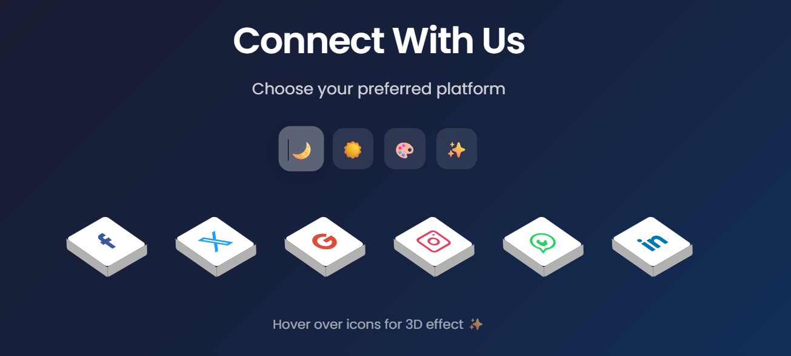

# 🎨 Social Buttons 3D

Beautiful animated 3D social media buttons with multiple theme variants. Pure CSS magic with smooth hover effects!



## ✨ Features

- **6 Social Platforms** - Facebook, X (Twitter), Google, Instagram, WhatsApp, LinkedIn
- **4 Theme Variants** - Dark, Light, Gradient, and Neon themes
- **3D Isometric Design** - Stunning perspective with depth effect
- **Smooth Animations** - Hover lift effect with realistic shadows
- **Tooltips** - Platform names appear on hover
- **Fully Responsive** - Works on all screen sizes
- **Accessible** - Keyboard navigation & screen reader friendly
- **Pure CSS** - No JavaScript required for animations

## 🎭 Theme Variants

| Theme | Description |
|-------|-------------|
| 🌙 Dark | Deep blue gradient background (default) |
| ☀️ Light | Clean white/gray minimal design |
| 🎨 Gradient | Animated rainbow gradient background |
| ✨ Neon | Dark with glowing hover effects |

## 🚀 Quick Start

1. Clone the repository:
```bash
git clone https://github.com/YOUR_USERNAME/social-buttons-3d.git
```

2. Open `index.html` in your browser

That's it! No build tools or dependencies required.

## 📁 Project Structure

```
social-buttons-3d/
├── index.html      # Main HTML file
├── style.css       # All styles and animations
├── image.png       # Preview image
└── README.md       # Documentation
```

## 🛠️ Customization

### Add Your Social Links

Edit the `href` attributes in `index.html`:

```html
<a class="social-link" href="https://facebook.com/YOUR_PAGE" ...>
<a class="social-link" href="https://wa.me/YOUR_NUMBER" ...>
```

### Add New Social Icons

1. Add a new `<li>` element in the social list
2. Include your SVG icon
3. Add corresponding styles in `style.css`:

```css
.social .social-item:nth-child(7) a {
  color: #YOUR_COLOR;
}

.social .social-item:nth-child(7):hover a {
  background: #YOUR_COLOR;
  color: #ffffff;
}
```

### Change Default Theme

Modify the JavaScript at the bottom of `index.html`:

```javascript
body.classList.add('theme-light'); // Change to your preferred theme
```

## 🎨 Brand Colors Used

| Platform | Color |
|----------|-------|
| Facebook | `#3b5999` |
| X (Twitter) | `#1da1f2` |
| Google | `#dd4b39` |
| Instagram | Gradient |
| WhatsApp | `#25D366` |
| LinkedIn | `#0077B5` |

## 📱 Browser Support

- ✅ Chrome
- ✅ Firefox
- ✅ Safari
- ✅ Edge
- ✅ Opera

## 📄 License

MIT License - feel free to use in personal and commercial projects!

## 🤝 Contributing

Contributions are welcome! Feel free to:

1. Fork the repository
2. Create your feature branch (`git checkout -b feature/amazing-feature`)
3. Commit your changes (`git commit -m 'Add amazing feature'`)
4. Push to the branch (`git push origin feature/amazing-feature`)
5. Open a Pull Request

## ⭐ Show Your Support

Give a ⭐ if you like this project!

---

Made with ❤️ by [Your Name]
